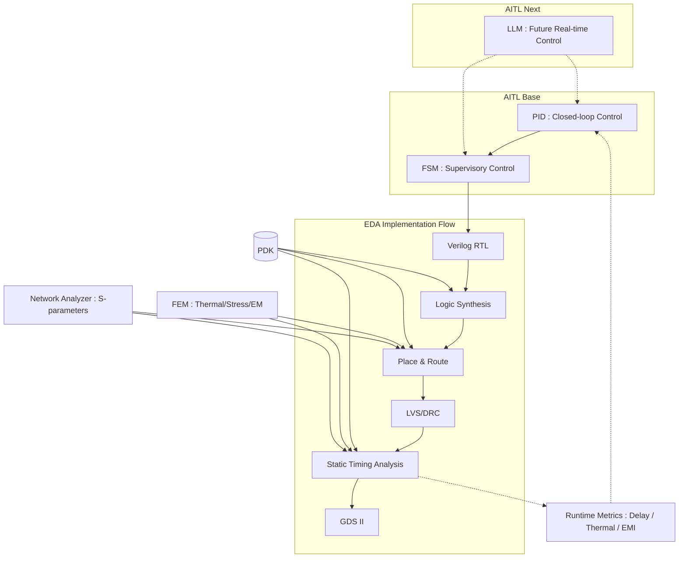

---

# 📕 特別編 第6章：SystemDK with AITL 論文公開 *(Final Chapter)*  
**Special Chapter 6: Research Paper on SystemDK with AITL *(Final Chapter)***

> ⚠️ 本章は **個人研究プロジェクト** に基づくまとめです。  
> 現行実装は **PID＋FSM** が中心であり、**LLM 統合は AITL Next（将来拡張）** として位置づけています。  
> 将来、計算性能向上とモデル軽量化によって LLM がリアルタイム制御層に参入するシナリオを描いています。  
>
> ⚠️ This chapter is based on an **individual research project**.  
> The current implementation focuses on **PID + FSM**, while **LLM integration is positioned as AITL Next (future extension)**.  
> It assumes that with improved computational performance and model lightweighting, LLM will join the real-time control layer in the future.

---

## 🔗 公式リンク / *Official Links*

| 言語 / Language | GitHub Pages 🌐 | GitHub 💻 |
|-----------------|----------------|-----------|
| 🇯🇵 日本語 / *Japanese* |  |  |

---

## 1. 📝 背景と課題 / *Introduction*
- 従来のDTCO（Design-Technology Co-Optimization）は **静的補償・過大ガードバンド依存** が課題。  
- サブ2nm以降では **RC遅延、熱結合、EMI/EMC変動** が深刻化。  
- これらに対して **実時間でのクロスレイヤー制御** が必要。  

*Traditional DTCO relies on static compensation and large guardbands.  
At sub-2nm nodes, RC delay, thermal coupling, and EMI/EMC variations become critical.  
Real-time cross-layer control is required.*

---

## 2. ⚙️ 提案枠組み / *Proposed Framework: SystemDK with AITL*

### **現行実装（AITL Base）**  
- **PID**：リアルタイム安定化制御（閉ループ）  
  → MATLAB/Simulink を用いた設計。遅延・熱・EMI変動を補償。  
- **FSM**：モード遷移・状態監督  
  → Stateflow による有限状態機械で、PIDの挙動を監督・安全制約を保証。  

**Current Implementation (AITL Base)**  
- **PID**: Real-time stabilization control (closed-loop)  
  → Designed with MATLAB/Simulink. Compensates delay, thermal, and EMI variations.  
- **FSM**: Mode transition and supervisory control  
  → Modeled with Stateflow to monitor PID behavior and ensure safety constraints.  

---

### **将来拡張（AITL Next）**  
- **LLM**：リアルタイム統合（Nextステージ）  
  - 現状：設計支援・オフライン解析（EDAレポート解析、ゲイン最適化、FSMルール提案）  
  - 将来：計算性能向上と軽量化により、**リアルタイム制御層に参入**  
  - 役割：  
    - 劣化・故障時に即時補償則を再設計  
    - 未知の外乱に対して動的適応  

**Future Extension (AITL Next)**  
- **LLM**: Real-time integration (Next stage)  
  - Current role: design support & offline analysis (EDA report parsing, PID gain tuning, FSM rule generation)  
  - Future role: with improved computational performance and lightweighting, **LLM joins the real-time control layer**  
  - Functions:  
    - Redesign control laws in case of degradation/failure  
    - Adapt dynamically to unknown disturbances  

---

### 📊 Fig.1: SystemDK with AITL — From Control to GDS

---

## 3. 🧩 技術的ポイント / *Key Technical Points*
- **RC遅延変動補償 / RC Delay Compensation**  
  → PID＋FSMで安定化  

*Stabilization of RC delay variation using PID + FSM*  

- **熱結合制御 / Thermal Coupling Control**  
  → シミュレーション上で大幅に抑制（理想値）  

*Significant suppression in simulation (ideal values)*  

- **応力・Vthシフト補償 / Stress & Vth Shift Compensation**  
  → 将来はLLMを含めた動的再設計で対応  

*Future dynamic redesign including LLM*  

- **EMI/EMC耐性向上 / EMI/EMC Robustness**  
  → PID＋FSMによりジッタを抑制、LLM参入後は更なる適応性向上  

*PID + FSM reduce jitter; LLM enhances adaptability in the future*  

---

## 4. 🔬 検証結果 / *Simulation Results*
※ 以下は **シミュレーション理想値**。実装値は異なる可能性があります。  

*The following are **simulation ideal values**. Actual implementation may differ.*  

| Metric / 指標 | Conventional | PID only | PID+FSM | PID+FSM+LLM (Next) |
|---------------|--------------|----------|---------|--------------------|
| RC Delay Variation | 1.0 (norm.) | 0.2 | 0.15 | **≪0.1 (ideal)** |
| Thermal Rise (ΔT) | +12 K | +4 K | +2 K | **≪1 K (ideal)** |
| EMI Jitter | 100 ps | 20 ps | 10 ps | **≪5 ps (ideal)** |

---

## 5. 🌍 意義と応用 / *Significance & Applications*
- **ガードバンド削減 / Guardband Reduction** → 消費電力・性能最適化  
- **信頼性向上 / Reliability Improvement** → 熱暴走・EMI不良の抑制  
- **産業応用 / Industrial Application** → 教材・PoCとしての価値、将来はEDAフロー統合  

*Guardband reduction → Power/performance optimization  
Reliability improvement → Suppression of thermal runaway and EMI failures  
Industrial application → Educational/PoC value, future EDA flow integration*  

---

## 6. 🚀 今後の展望 / *Future Work*
- **AITL Base**：PID＋FSMによる実用的制御の確立  
- **AITL Next**：軽量化LLMのリアルタイム実装、EDAフローとのAI統合  
- **PoC**：実チップ試作・産業応用に向けた検証  

*AITL Base: Establish practical control with PID + FSM  
AITL Next: Real-time implementation of lightweight LLM, AI-EDA integration  
PoC: Prototype chips & industrial validation*  

---

## 7. 📄 論文・関連リンク / *Downloads & Related Links*
- 📑 [Main Paper (PDF)](systemdk_aitl2025.pdf)  

---

## 8. 👤 著者・ライセンス / *Author & License*

| 📌 Item | 📄 Details |
|------|------|
| **Author** | **三溝 真一 / Shinichi Samizo** |
| **💻 GitHub** |  |
| **📜 License** | Code: [MIT](https://opensource.org/licenses/MIT) ・ Text: [CC BY 4.0](https://creativecommons.org/licenses/by/4.0/) ・ Figures: [CC BY-NC 4.0](https://creativecommons.org/licenses/by-nc/4.0/) |

---

## 🔙 戻る / *Back to Top*
🏠 [Edusemi-v4x](../) ｜ 📂 [GitHub Repo](https://github.com/Samizo-AITL/Edusemi-v4x)
