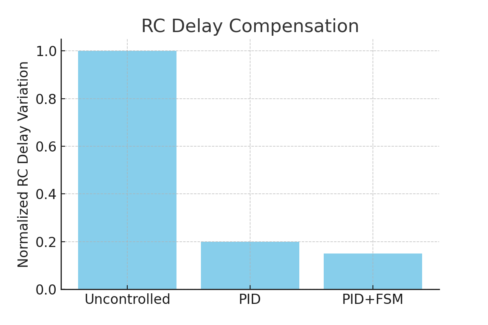
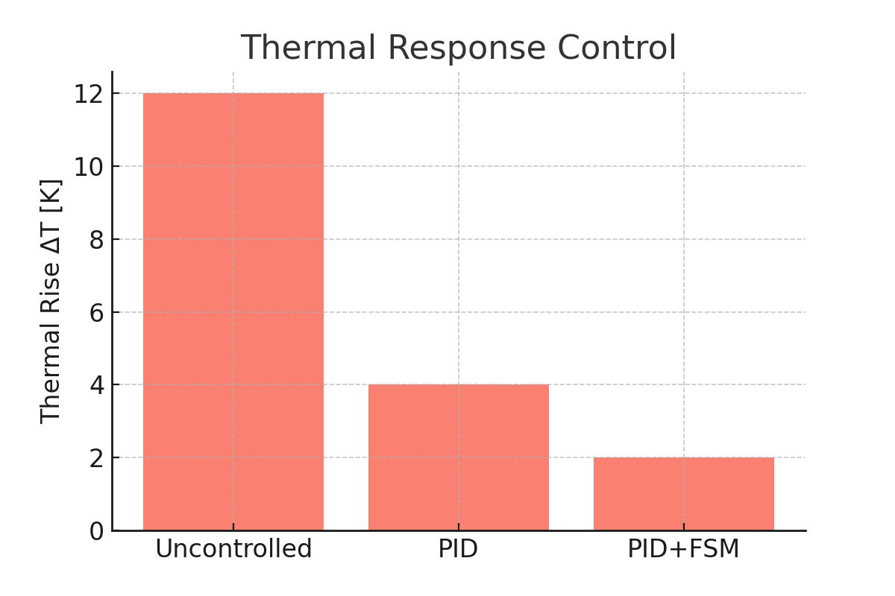
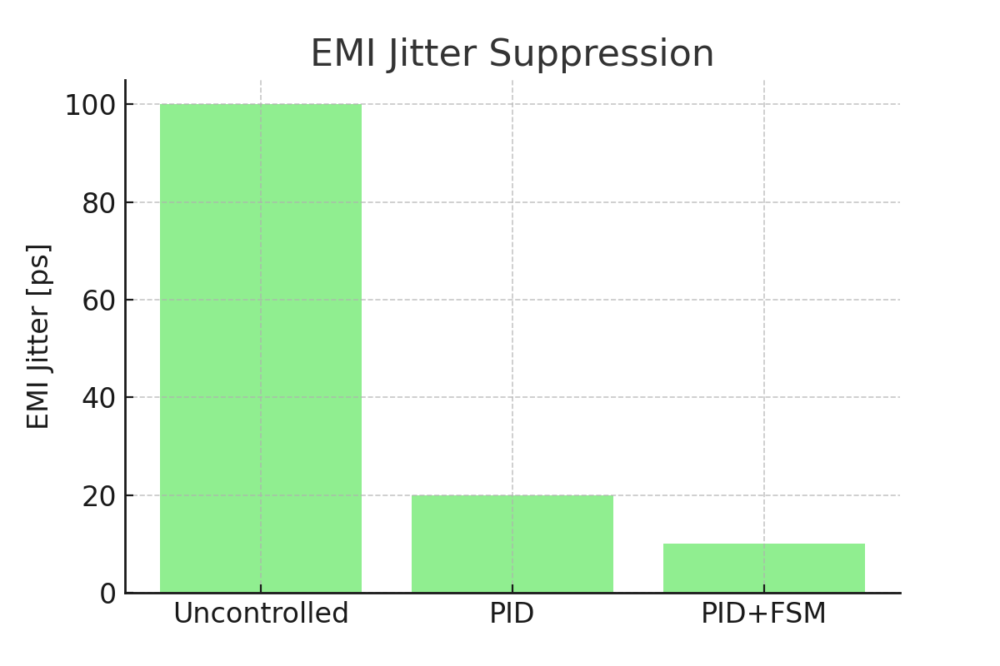
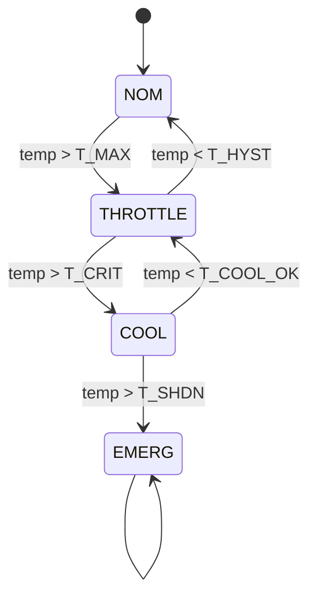

---

# 📕 特別編 第6章：SystemDK with AITL 論文公開 *(Final Chapter)*  
**Special Chapter 6: Research Paper on SystemDK with AITL *(Final Chapter)***

> ⚠️ 本章は **個人研究プロジェクト** に基づくまとめです。  
> 現行実装は **PID＋FSM** が中心であり、**LLM 統合は AITL Next（将来拡張）** として位置づけています。  
> 将来、計算性能向上とモデル軽量化によって LLM がリアルタイム制御層に参入するシナリオを描いています。  
>
> ⚠️ This chapter is based on an **individual research project**.  
> The current implementation focuses on **PID + FSM**, while **LLM integration is positioned as AITL Next (future extension)**.  
> It assumes that with improved computational performance and model lightweighting, LLM will join the real-time control layer in the future.

---

## 1. 📝 背景と課題 / *Introduction*
- 従来のDTCOは **静的補償・過大ガードバンド依存** が課題。  
- サブ2nm以降では **RC遅延、熱結合、EMI/EMC変動** が深刻化。  
- **実時間クロスレイヤー制御** の必要性が増大。  

*Traditional DTCO relies on static compensation and large guardbands.  
At sub-2nm nodes, RC delay, thermal coupling, and EMI/EMC variations become critical.  
Real-time cross-layer control is required.*

---

## 2. ⚙️ 提案枠組み / *Proposed Framework: SystemDK with AITL*

### 現行実装（AITL Base） / *Current Implementation (AITL Base)*
- **PID**：リアルタイム安定化制御（遅延・温度・電圧補償）  
- **FSM**：安全監督（上限制約、緊急停止）  

**PID**: Real-time stabilization (delay, temperature, voltage compensation)  
**FSM**: Supervisory safety control (limits, emergency stop)  

### 将来拡張（AITL Next） / *Future Extension (AITL Next)*
- **LLM**：将来、計算性能向上と軽量化により **リアルタイム制御層に参入**  
- **役割**：PIDゲイン再調整、FSMルール自動更新、故障・未知外乱への即応  

**LLM**: Future entry into real-time control with enhanced compute & lightweight models  
**Roles**: PID gain redesign, FSM rule regeneration, fast adaptation to failures/unknown disturbances  

---

## 3. 🧮 数式モデル / *Analytical Models*

- **RC遅延モデル / RC Delay Model**  
$begin:math:display$
t_{pd}(T, \\sigma, f) = R_0 \\cdot \\big(1 + \\alpha_T (T-T_0) + \\alpha_\\sigma \\sigma \\big) \\cdot C(f) + \\Delta_{EMI}(f)
$end:math:display$

- **熱結合モデル / Thermal Coupling**  
$begin:math:display$
C_{th}\\frac{dT}{dt} + \\frac{T - T_{amb}}{R_{th}} = P_{chip}(t)
$end:math:display$

- **応力によるVthシフト / Stress-induced Vth Shift**  
$begin:math:display$
\\Delta V_{th}(\\sigma) = \\kappa \\cdot \\sigma
$end:math:display$

- **EMI注入モデル / EMI Injection**  
$begin:math:display$
v_{emi}(t) = A \\sin(2\\pi f_{emi} t)
$end:math:display$

---

## 4. 🔬 シミュレーション結果 / *Simulation Results*
※ 以下は **理想化モデルによるシミュレーション結果**。実チップとは異なる可能性があります。  
*The following are simulation results from idealized models; real chip values may differ.*  

### 4.1 RC遅延補償 / RC Delay Compensation


- 制御なし：大きなばらつき  
- PID：±20%に収束  
- PID＋FSM：±10%以内に収束  

*Uncontrolled: large variations  
PID: converges within ±20%  
PID+FSM: converges within ±10%*  

---

### 4.2 熱応答制御 / Thermal Response Control


- 制御なし：+12Kオーバーシュート  
- PID：+4K程度  
- PID＋FSM：+2K以下  

*Uncontrolled: +12K overshoot  
PID: ~+4K  
PID+FSM: ≤+2K*  

---

### 4.3 EMIジッタ抑制 / EMI Jitter Suppression


- 制御なし：100psジッタ  
- PID：20ps程度  
- PID＋FSM：10ps程度  

*Uncontrolled: 100ps jitter  
PID: ~20ps  
PID+FSM: ~10ps*  

---

### 4.4 総合比較表 / Summary Table
| 指標 / Metric | 制御なし / Uncontrolled | PIDのみ / PID only | PID＋FSM | LLM (Next, 理想値 / Ideal) |
|---------------|-------------------------|--------------------|-----------|--------------------------|
| RC Delay Variation | 1.0 (norm.) | 0.2 | 0.15 | ≪0.1 |
| Thermal Rise ΔT | +12 K | +4 K | +2 K | ≪1 K |
| EMI Jitter | 100 ps | 20 ps | 10 ps | ≪5 ps |

---

## 5. 💻 実装PoC / *Implementation PoC*

### 5.1 PID Verilog RTL
```verilog
module pid_ctrl #(parameter W=16, FRAC=8)(
  input  logic clk, rst_n,
  input  logic signed [W-1:0] e,
  input  logic signed [W-1:0] Kp, Ki, Kd,
  output logic signed [W-1:0] u_out
);
  logic signed [W-1:0] i_acc, e_prev, de;
  always_ff @(posedge clk or negedge rst_n) begin
    if(!rst_n) begin i_acc<=0; e_prev<=0; u_out<=0; end
    else begin
      de    <= e - e_prev;
      i_acc <= i_acc + e;
      u_out <= (Kp*e >>> FRAC) + (Ki*i_acc >>> FRAC) + (Kd*de >>> FRAC);
      e_prev<= e;
    end
  end
endmodule
```

---

### 5.2 FSM 状態遷移図 / FSM State Transitions


---

### 5.3 YAML 設定例 / YAML Example
```yaml
targets:
  delay_ps: 1200
  temp_C:   80
limits:
  T_MAX: 90
  T_CRIT: 95
  T_SHDN: 105
  EMI_MAX: 0.6
pid:
  Kp: 0.8
  Ki: 0.05
  Kd: 0.1
actuator_bounds:
  freq_mhz: [800, 3200]
  vcore_mv: [700, 1100]
  fan_pwm:  [0, 255]
```

---

## 6. 🏭 EDAとの連携 / *EDA Integration*
- 制御モデル（PID＋FSM）は **Verilog RTL化** され、通常のEDAフロー（論理合成 → 配置配線 → STA → GDS II）に統合される。  
- **FEM解析（熱・応力・電磁界）** の結果を物理設計制約としてP&RやSTAに反映。  
- **ネットワークアナライザによるSパラ測定** を取り込み、インターコネクトの伝送特性をEDAツールで考慮。  
- 将来的には **LLM（AITL Next）** がEDAログやPVTシミュレーションを解析し、ゲイン再調整・FSMルール修正を自動生成 → RTLへフィードバック。  

*Control models (PID+FSM) are converted to Verilog RTL and integrated into standard EDA flows (Synthesis → P&R → STA → GDS II).  
FEM analysis (thermal/stress/EM) feeds back constraints to P&R and STA.  
S-parameter measurements are included in EDA to capture interconnect transmission effects.  
In the future, LLM (AITL Next) will analyze EDA logs and PVT simulations to automatically redesign gains and FSM rules, feeding them back to RTL.*  

---

```mermaid
flowchart TB
    subgraph Modeling [Control Modeling]
        PID[PID Controller] --> FSM[FSM Supervisor]
        FSM --> RTL[Verilog RTL]
        LLM[LLM (Next)] -.-> FSM
    end

    subgraph EDA [EDA Flow]
        RTL --> Synth[Logic Synthesis]
        Synth --> PnR[Place & Route]
        PnR --> LVS[LVS/DRC]
        LVS --> STA[Static Timing Analysis]
        STA --> GDS[GDS II]
    end

    STA -.-> Metrics[Runtime Metrics: Delay/Thermal/EMI]
    Metrics -.-> PID
    FEM[FEM Analysis] --> PnR
    FEM --> STA
    NA[S-parameter Measurement] --> STA
    NA --> PnR

    PDK[(Process Design Kit)] --> Synth
    PDK --> PnR
    PDK --> STA
```

---

## 7. 🚀 今後の展望 / *Future Work*
- **AITL Base**：PID＋FSM による安定制御の確立  
- **AITL Next**：軽量化LLMを用いたリアルタイム制御、EDAフローへの統合  
- **PoC**：実チップ試作と産業応用での実証  

*AITL Base: Establish stable control with PID + FSM  
AITL Next: Real-time LLM (lightweight) integration into EDA flows  
PoC: Prototype chips and industrial validation*  

---

## 8. 📄 論文・関連リンク / *Downloads & Related Links*
- 📑 [Main Paper (PDF)](systemdk_aitl2025.pdf)  

---

## 9. 👤 著者・ライセンス / *Author & License*

| 📌 Item | 📄 Details |
|------|------|
| **Author** | **三溝 真一 / Shinichi Samizo** |
| **💻 GitHub** | [](https://github.com/Samizo-AITL) |
| **📜 License** | Code: [MIT](https://opensource.org/licenses/MIT) ・ Text: [CC BY 4.0](https://creativecommons.org/licenses/by/4.0/) ・ Figures: [CC BY-NC 4.0](https://creativecommons.org/licenses/by-nc/4.0/) |

---

## 🔙 戻る / *Back to Top*
🏠 [Edusemi-v4x](../) ｜ 📂 [GitHub Repo](https://github.com/Samizo-AITL/Edusemi-v4x)
