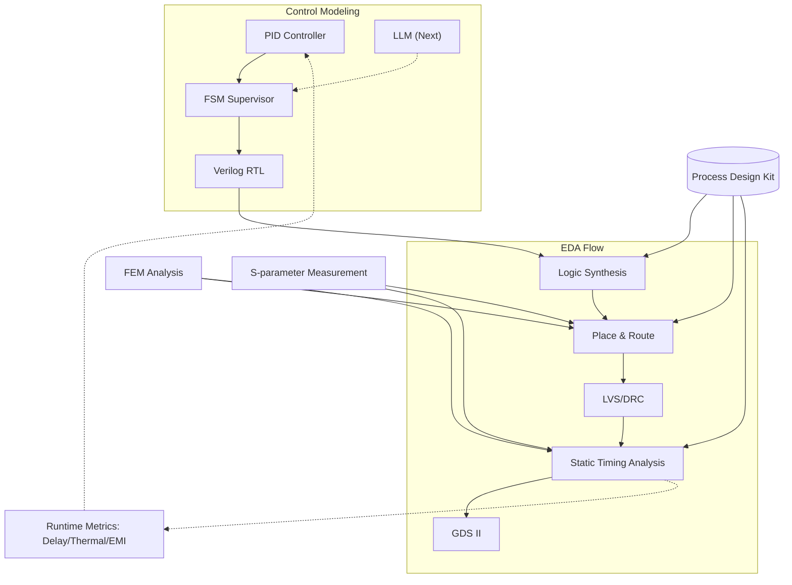
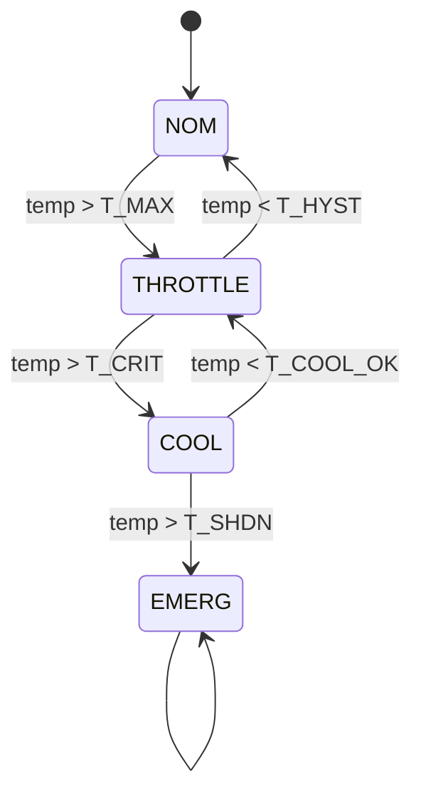

---

# 📕 特別編 第6章：SystemDK with AITL 論文公開 *(Final Chapter)*  
**Special Chapter 6: Research Paper on SystemDK with AITL *(Final Chapter)***

> ⚠️ 本章は **個人研究プロジェクト** に基づくまとめです。  
> 現行実装は **PID＋FSM** が中心であり、**LLM 統合は AITL Next（将来拡張）** として位置づけています。  
> 将来、計算性能向上とモデル軽量化によって LLM がリアルタイム制御層に参入するシナリオを描いています。  
>
> ⚠️ This chapter is based on an **individual research project**.  
> The current implementation focuses on **PID + FSM**, while **LLM integration is positioned as AITL Next (future extension)**.  
> It assumes that with improved computational performance and model lightweighting, LLM will join the real-time control layer in the future.

---

## 1. 📝 はじめに / *Introduction & Objective*

本章の目的は、**SystemDK with AITL の制御モデル（PID＋FSM＋将来のLLM）をEDA設計フローに統合し、サブ2nm世代で深刻化する変動・劣化を実時間で補償する手法を提示すること**である。  

従来のDTCO（Design-Technology Co-Optimization）は静的補償・過大ガードバンド依存であり、以下の課題を抱えている：  

- **RC遅延変動**：配線スケーリングによるばらつきがSTAを不安定化  
- **熱結合**：3D積層・高密度化による温度上昇がP&R制約を逸脱  
- **EMI/EMC変動**：高速信号伝送でのジッタがSI/EMC解析に影響  
- **信頼性低下**：応力やVthシフトがPDKパラメータ設計に反映されにくい  

これらを解決するため、本研究では以下を提案する：  

1. **PID** によるリアルタイム安定化制御  
2. **FSM** によるモード監督と安全制御  
3. **EDAフロー統合**：Verilog RTL化した制御ロジックを Synth → P&R → STA → GDS II に直結  
4. **AITL Next (LLM)** によるEDAログ解析と将来のリアルタイム適応  

---

## 2. ⚙️ 提案フレームワーク / *Proposed Framework: SystemDK with AITL*

### 現行実装（AITL Base） / *Current Implementation (AITL Base)*
- **PID**：遅延・温度・電圧変動のリアルタイム補償  
- **FSM**：制御モード遷移・安全監督（上限制約、緊急停止）  

### 将来拡張（AITL Next） / *Future Extension (AITL Next)*
- **LLM**：EDAログやシミュレーション結果を解析し、PIDゲインやFSMルールを再設計  
- **役割**：EDAフローにフィードバックし、将来的にリアルタイム制御へ参入  

---

### 📊 EDA統合図 / *EDA Integration Flow*



---

## 3. 🧮 数式モデルとEDA対応 / *Analytical Models and EDA Mapping*

- **RC遅延モデル / RC Delay Model**
  
$$
t_{pd}(T, \sigma, f) = R_0 \cdot \big(1 + \alpha_T (T-T_0) + \alpha_\sigma \sigma \big)\,C(f) + \Delta_{EMI}(f)
$$

→ STAにおける **パス遅延制約** として反映  

- **熱結合モデル / Thermal Coupling**
  
$$
C_{th}\frac{dT}{dt} + \frac{T - T_{amb}}{R_{th}} = P_{chip}(t)
$$

→ P&Rでの **配置温度制約** に対応  

- **応力によるVthシフト / Stress-induced Vth Shift**
  
$$
\Delta V_{th}(\sigma) = \kappa \cdot \sigma
$$

→ PDKパラメータ補正やSPICEモデル更新に対応  

- **EMI注入モデル / EMI Injection**

$$
v_{emi}(t) = A \sin(2\pi f_{emi} t)
$$

→ SI/EMC解析における **クロックジッタ制約** として導入  

---

## 4. 🔬 シミュレーション結果とEDAでの意味 / *Simulation Results with EDA Implications*

※ 以下は理想化モデルによるシミュレーション結果。実チップとは異なる可能性あり。  
*Results are from idealized models; real chip values may differ.*  

### 4.1 RC遅延補償 / RC Delay Compensation


- 制御なし：大きなばらつき → STAでタイミングクロージャ困難  
- PID：±20%に収束 → STAでパス余裕改善  
- PID＋FSM：±10%以内 → STAでスラック安定化  

---

### 4.2 熱応答制御 / Thermal Response Control


- 制御なし：+12Kオーバーシュート → P&R制約逸脱  
- PID：+4K程度 → 設計範囲内  
- PID＋FSM：+2K以下 → 3D-IC設計の温度制約に適合  

---

### 4.3 EMIジッタ抑制 / EMI Jitter Suppression


- 制御なし：100psジッタ → SI/EMC NG  
- PID：20ps → 一部合格  
- PID＋FSM：10ps → EMC設計規格適合レベル  

---

### 4.4 総合比較表 / Summary Table
| 指標 / Metric | 制御なし / Uncontrolled | PIDのみ / PID only | PID＋FSM | LLM (Next, 理想値 / Ideal) | EDAでの意味 / EDA Implication |
|---------------|-------------------------|--------------------|-----------|--------------------------|------------------------------|
| RC Delay Variation | 1.0 (norm.) | 0.2 | 0.15 | ≪0.1 | STAタイミング収束性 |
| Thermal Rise ΔT | +12 K | +4 K | +2 K | ≪1 K | P&R配置温度制約 |
| EMI Jitter | 100 ps | 20 ps | 10 ps | ≪5 ps | SI/EMC適合性 |

---

## 5. 💻 実装PoC / *Implementation PoC*

### 5.1 PID Verilog RTL
```verilog
module pid_ctrl #(parameter W=16, FRAC=8)(
  input  logic clk, rst_n,
  input  logic signed [W-1:0] e,
  input  logic signed [W-1:0] Kp, Ki, Kd,
  output logic signed [W-1:0] u_out
);
  logic signed [W-1:0] i_acc, e_prev, de;
  always_ff @(posedge clk or negedge rst_n) begin
    if(!rst_n) begin i_acc<=0; e_prev<=0; u_out<=0; end
    else begin
      de    <= e - e_prev;
      i_acc <= i_acc + e;
      u_out <= (Kp*e >>> FRAC) + (Ki*i_acc >>> FRAC) + (Kd*de >>> FRAC);
      e_prev<= e;
    end
  end
endmodule
```

---

### 5.2 FSM 状態遷移図 / FSM State Transitions


---

### 5.3 YAML 設定例 / YAML Example
```yaml
targets:
  delay_ps: 1200
  temp_C:   80
limits:
  T_MAX: 90
  T_CRIT: 95
  T_SHDN: 105
  EMI_MAX: 0.6
pid:
  Kp: 0.8
  Ki: 0.05
  Kd: 0.1
actuator_bounds:
  freq_mhz: [800, 3200]
  vcore_mv: [700, 1100]
  fan_pwm:  [0, 255]
```

---

## 6. 🚀 今後の展望 / *Future Work*
- **AITL Base**：PID＋FSM による安定制御の確立とEDAフローへのPoC統合  
- **AITL Next**：軽量化LLMを用いたリアルタイムEDA解析と制御補償再設計  
- **産業応用**：実チップ試作とEDAツール連携によるAI駆動DTCOの実証  

*AITL Base: Establish stable PID+FSM control integrated into EDA flows  
AITL Next: Lightweight LLM for real-time EDA analysis and compensation redesign  
Industrial: Prototype chips and EDA tool collaboration for AI-driven DTCO*  

---

## 7. 📄 論文・関連リンク / *Downloads & Related Links*
- 📑 [Main Paper (PDF)](systemdk_aitl2025.pdf)  

---

## 8. 👤 著者・ライセンス / *Author & License*

| 📌 Item | 📄 Details |
|------|------|
| **Author** | **三溝 真一 / Shinichi Samizo** |
| **💻 GitHub** | [](https://github.com/Samizo-AITL) |
| **📜 License** | Code: [MIT](https://opensource.org/licenses/MIT) ・ Text: [CC BY 4.0](https://creativecommons.org/licenses/by/4.0/) ・ Figures: [CC BY-NC 4.0](https://creativecommons.org/licenses/by-nc/4.0/) |

---

## 🔙 戻る / *Back to Top*
🏠 [Edusemi-v4x](../) ｜ 📂 [GitHub Repo](https://github.com/Samizo-AITL/Edusemi-v4x)
