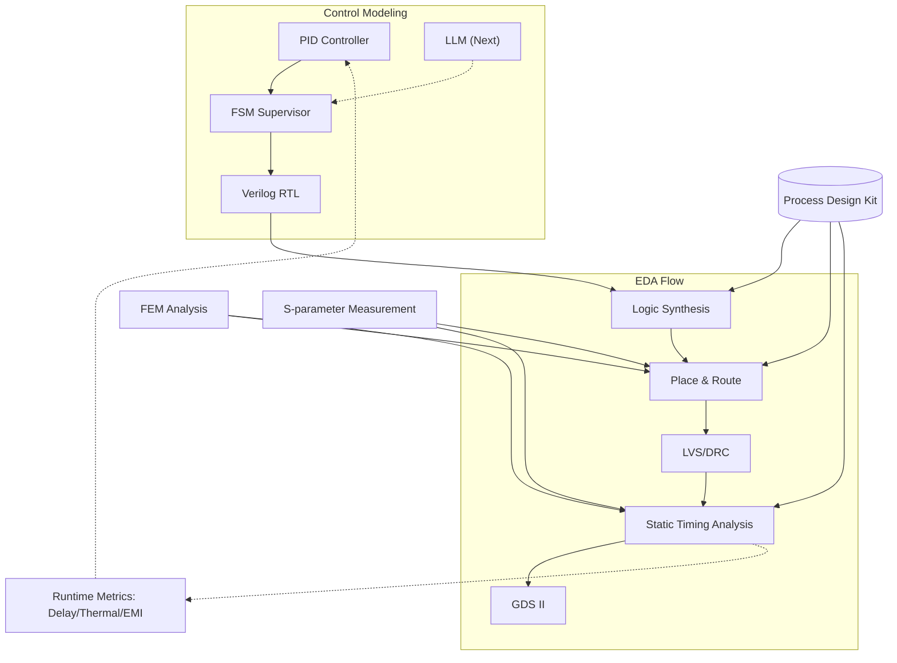

---

# 📕 特別編 第6章：SystemDK with AITL 論文公開 *(Final Chapter)*  
**Special Chapter 6: Research Paper on SystemDK with AITL *(Final Chapter)***

> ⚠️ 本章は **個人研究プロジェクト** に基づくまとめです。  
> 現行実装は **PID＋FSM** が中心であり、**LLM統合はAITL Next（将来拡張）** として位置づけています。  
> 将来、計算性能向上とモデル軽量化によって LLM がリアルタイム制御層に参入するシナリオを描いています。  
>
> ⚠️ *This chapter is based on an **individual research project**.  
> The current implementation focuses on **PID + FSM**, while **LLM integration is positioned as AITL Next (future extension)**.  
> It assumes that with improved computational performance and model lightweighting, LLM will join the real-time control layer in the future.*

---

## 1. 📝 はじめに / *Introduction & Objective*

**目的**：  
SystemDK with AITL の制御モデル（PID＋FSM＋将来のLLM）を **EDA設計フローに統合**し、サブ2nm世代で深刻化する変動・劣化を **実時間補償** する方法を提示する。  

*Objective:  
To integrate the SystemDK with AITL control model (PID + FSM + future LLM) into the **EDA design flow**, providing **real-time compensation** for variations and degradations critical at sub-2nm nodes.*  

---

### ❌ 従来DTCOの課題 / *Limitations of Conventional DTCO*
| 課題 / Issue | 日本語解説 | *English Explanation* |
|--------------|------------|-----------------------|
| **RC遅延変動** | 配線スケーリングでSTAが不安定化 | *RC delay variation destabilizes STA* |
| **熱結合** | 3D積層で温度上昇、P&R制約逸脱 | *Thermal coupling from 3D stacking violates P&R constraints* |
| **EMI/EMC変動** | 高速伝送でジッタがSI/EMC解析に影響 | *EMI/EMC variations induce jitter, affecting SI/EMC analysis* |
| **信頼性低下** | 応力やVthシフトがPDK反映困難 | *Stress and Vth shifts poorly reflected in PDK models* |

---

### ✅ 提案アプローチ / *Proposed Approach*
1. **PID**：リアルタイム安定化制御  
   *Real-time stabilization with PID*  
2. **FSM**：モード監督と安全制御  
   *Supervisory control and safety enforcement with FSM*  
3. **EDAフロー統合**：RTL化した制御ロジックを Synth → P&R → STA → GDS II に直結  
   *Integration into EDA flow (RTL → Synth → P&R → STA → GDS II)*  
4. **AITL Next (LLM)**：EDAログ解析と将来のリアルタイム適応  
   *EDA log analysis and future real-time adaptation with LLM*  

---

## 2. ⚙️ 提案フレームワーク / *Proposed Framework*

### 現行実装（AITL Base） / *Current Implementation (AITL Base)*
- **PID**：遅延・温度・電圧変動のリアルタイム補償  
  *Real-time compensation of delay, temperature, and voltage variations*  
- **FSM**：モード遷移・安全監督  
  *Supervisory control of modes and safety limits*  

### 将来拡張（AITL Next） / *Future Extension (AITL Next)*
- **LLM**：EDAログ解析によるゲイン再設計・FSMルール更新  
  *LLM for gain redesign and FSM rule updates via EDA log analysis*  
- **役割**：EDAフィードバックを利用し将来的にリアルタイム制御層に参入  
  *Role: Enter real-time control layer using EDA feedback in the future*  

---

### 📊 EDA統合図 / *EDA Integration Flow*

---

## 3. 🧮 数式モデルとEDA対応 / *Analytical Models and EDA Mapping*

| モデル / Model | 数式 / Equation | EDA対応 / *EDA Mapping* |
|----------------|-----------------|-------------------------|
| **RC遅延** | $$t_{pd}(T, \sigma, f) = R_0 (1+\alpha_T (T-T_0)+\alpha_\sigma \sigma)C(f)+\Delta_{EMI}(f)$$ | STAでのパス遅延制約 / *STA path delay constraints* |
| **熱結合** | $$C_{th}\frac{dT}{dt} + \frac{T-T_{amb}}{R_{th}} = P_{chip}(t)$$ | P&R配置温度制約 / *P&R thermal placement constraints* |
| **Vthシフト** | $$\Delta V_{th}(\sigma)=\kappa\sigma$$ | PDK/SPICEパラメータ補正 / *PDK & SPICE updates* |
| **EMI注入** | $$v_{emi}(t)=A\sin(2\pi f_{emi}t)$$ | SI/EMCクロックジッタ制約 / *SI/EMC jitter constraints* |

---

## 4. 🔬 シミュレーション結果とEDAでの意味 / *Simulation Results with EDA Implications*

### 4.1 RC遅延補償 / *RC Delay Compensation*  

- **制御なし**：大きなばらつき → STAクロージャ困難  
- **PID**：±20%に収束 → STAパス余裕改善  
- **PID＋FSM**：±10%以内 → STAスラック安定化  

---

### 4.2 熱応答制御 / *Thermal Response Control*  

- **制御なし**：+12Kオーバーシュート → P&R制約逸脱  
- **PID**：+4K → 設計範囲内  
- **PID＋FSM**：+2K以下 → 3D-IC設計制約に適合  

---

### 4.3 EMIジッタ抑制 / *EMI Jitter Suppression*  

- **制御なし**：100ps → EMC不合格  
- **PID**：20ps → 一部合格  
- **PID＋FSM**：10ps → EMC設計規格適合  

---

### 4.4 総合比較表 / *Summary Table*

| 指標 / Metric | 制御なし / Uncontrolled | PIDのみ / PID only | PID＋FSM | LLM Next (理想値 / Ideal) | EDAでの意味 / *EDA Implication* |
|---------------|-------------------------|--------------------|-----------|--------------------------|---------------------------------|
| **RC Delay Variation** | 1.0 (norm.) | 0.2 | 0.15 | ≪0.1 | STAタイミング収束性 / *STA closure* |
| **Thermal Rise ΔT** | +12 K | +4 K | +2 K | ≪1 K | P&R温度制約 / *P&R thermal constraint* |
| **EMI Jitter** | 100 ps | 20 ps | 10 ps | ≪5 ps | SI/EMC適合性 / *SI/EMC compliance* |

---

## 5. 💻 実装PoC / *Implementation PoC*

- **PID RTL実装 / *PID RTL Implementation***  
- **FSM遷移図 / *FSM Transition Diagram***  
- **YAML設定例 / *YAML Example***  

（※ここは既存のコードブロックを維持）

---

## 6. 🚀 今後の展望 / *Future Work*

- **AITL Base**：PID＋FSM による安定制御の確立とEDAフローへのPoC統合  
  *Establish PID+FSM stability and PoC integration into EDA flows*  
- **AITL Next**：軽量化LLMによるEDA解析・制御補償再設計  
  *Lightweight LLM for EDA log analysis and adaptive compensation redesign*  
- **産業応用**：実チップ試作とEDAツール連携によるAI駆動DTCOの実証  
  *Prototype chips and EDA tool collaboration for AI-driven DTCO*  

---

## 7. 📄 論文・関連リンク / *Downloads & Related Links*
- 📑 [Main Paper (PDF)](systemdk_aitl2025.pdf)  

---

## 8. 👤 著者・ライセンス / *Author & License*

| 📌 項目 / Item | 詳細 / Details |
|----------------|----------------|
| **Author** | **三溝 真一 / Shinichi Samizo** |
| **GitHub** |  |
| **License** | Code: [MIT](https://opensource.org/licenses/MIT) ・ Text: [CC BY 4.0](https://creativecommons.org/licenses/by/4.0/) ・ Figures: [CC BY-NC 4.0](https://creativecommons.org/licenses/by-nc/4.0/) |

---

## 🔙 戻る / *Back to Top*
🏠 [Edusemi-v4x](../) ｜ 📂 [GitHub Repo](https://github.com/Samizo-AITL/Edusemi-v4x)
