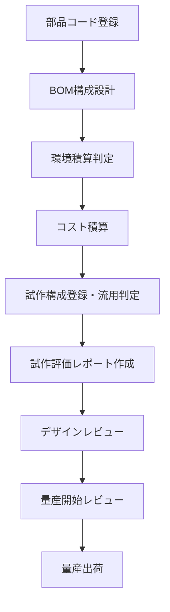

# 📘 特別編　第7章：完成体製品における開発ドキュメントとワークフロー

本章では、半導体単体ではなく、完成体製品（例：モジュール、装置、組込み機器）の開発において必要とされる各種ドキュメントとその運用フローについて体系的に学習します。構成管理、部品コード登録、環境対応、試作・評価、レビュー、量産移行といった製品ライフサイクル全体をカバーし、実務レベルで活用可能なテンプレート群とともに提供されます。

---

## 🎯 本章の目的

- 開発ドキュメントの全体像を把握し、製品開発の流れと紐づけて理解する
- 試作から量産までの各工程に必要なチェック項目・レビュー観点を明確にする
- PDMやPLM等の実務運用と接続可能な教材として活用する

---

## 📁 ディレクトリ構成

| ディレクトリ | 内容 |
|--------------|------|
| [`bom/`](bom/) | 部品コード管理、BOM構成、環境積算スキップ判定、コスト積算ルールなど |
| [`parts_code/`](parts_code/) | 部品コード登録規則、環境情報登録、輸出管理該非判定など |
| [`prototype/`](prototype/) | 試作構成管理、流用ルール、試作費用管理 |
| [`evaluation/`](evaluation/) | 試作評価レポート様式、評価項目、判定基準 |
| [`dr/`](dr/) | デザインレビューのチェックリストと運用ルール |
| [`mass_production_review/`](mass_production_review/) | 量産開始レビュー（Gate）基準、チェックリスト |
| [`templates/`](templates/) | 各種Excel・Wordテンプレート集 |
| [`assets/`](assets/) | 図表・ワークフロー・チェックリスト例など |

---

## 🚀 ワークフロー概略

---

## 📄 主なドキュメント

| ファイル | 説明 |
|---------|------|
| [`bom/bom_structure.md`](bom/bom_structure.md) | BOM構成管理規則 |
| [`bom/echam_skip_check.md`](bom/echam_skip_check.md) | 環境積算スキップ判定ルール |
| [`bom/cost_rollup.md`](bom/cost_rollup.md) | コスト積算ルール |
| [`parts_code/environmental_info_input.md`](parts_code/environmental_info_input.md) | 環境情報登録手順 |
| [`prototype/build_plan.md`](prototype/build_plan.md) | 試作構成・流用ルール |
| [`evaluation/report_format.md`](evaluation/report_format.md) | 試作評価レポート様式 |
| [`mass_production_review/mass_production_gate_rules.md`](mass_production_review/mass_production_gate_rules.md) | 量産開始Gate基準 |
| [`dr/dr_checklist.md`](dr/dr_checklist.md) | デザインレビュー・チェックリスト |

---

## 📝 注意事項

- ドキュメントは設計変更時に必ず更新し、常に最新状態を維持すること  
- テンプレートは [`templates/`](templates/) 内の標準フォーマットを使用すること  
- 各工程の証跡管理（レビュー記録、承認履歴など）は、PDMまたは社内共有環境で行うこと  

---

> 📌 本章は設計・製造・品質・調達・環境管理など多部門による連携を前提とした教材です。  
> 情報共有と連携強化を通じて、製品品質の向上と開発期間の短縮を実現することを目的としています。

---
