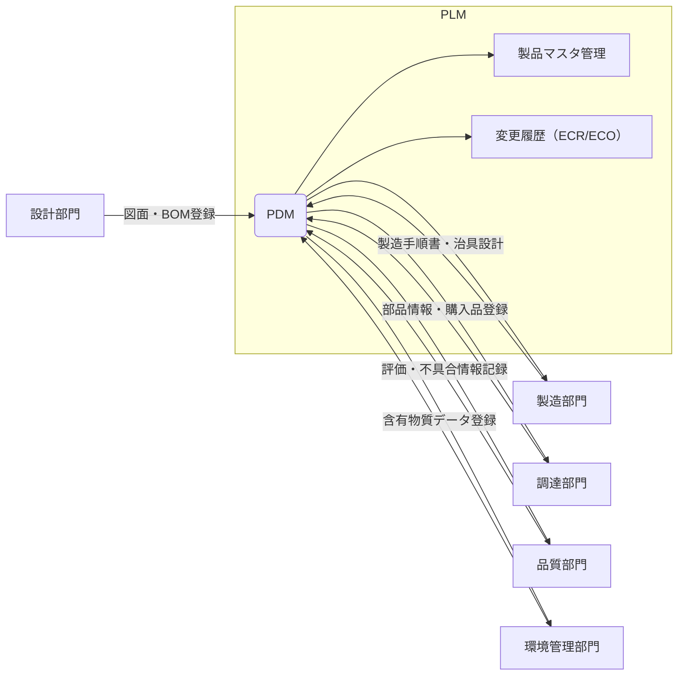

# 🔄 PDM/PLM連携と実務運用例

本資料では、製品開発ドキュメント群とPDM（Product Data Management）／PLM（Product Lifecycle Management）との連携を示し、実務運用の具体例を提示します。

---

## 📊 PDM/PLM連携構造（Mermaid図）

---

## 💼 実務におけるPDM/PLM運用例

### ● 部品コード登録
- 設計部門が初期仮登録  
- 環境部門と調達部門が材料情報や輸出該非情報を追記  
- 登録後、PDMで正式コード管理開始  

### ● BOM構成管理
- 設計BOMをPDMで構成展開（多階層対応）  
- コスト積算や在庫照会はPLM・ERPと連携  
- BOM構成変更時は自動的に下流通知（DRや製造）  

### ● 設計変更対応（ECR/ECO）
- 設計変更提案（ECR）を提出 → 承認プロセス後に変更指示（ECO）  
- 承認履歴・変更履歴はPDMで一元管理  
- 最新設計反映と同時に旧バージョンも保持  

### ● 試作と評価記録
- 試作履歴、評価レポート、問題点などはPDMに添付  
- 設計者・品質・製造部門が履歴確認可能  
- 試作から量産への改善トレーサビリティを保証  

### ● 量産移行（Gateレビュー）
- 必須資料（図面、BOM、治具、QC票など）をPDMから出力  
- Gateレビュー記録もPDMに保管（電子承認対応）

---
